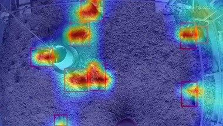

# 土雞辨識模型 (專案名稱)

## 介紹

這個專案基於 yolov7 架構，旨在辨識出牧場中的雞隻

## 功能

用yolov7將照片中的雞隻自動辨識出來

## 呈現效果

|                       原始圖片                       |                          推論結果                           |
| :-------------------------------------------------: | :--------------------------------------------------------: |
|  |  |

